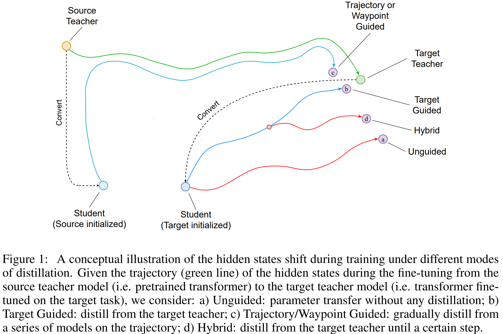

This repository contains the reference code for the paper 
[Joint Fine-tuning and Conversion of Pretrained Speech and Language Models towards Linear Complexity](https://arxiv.org/abs/2410.06846),
accepted by [ICLR2025](https://openreview.net/forum?id=90Db4RUBc7).

# Abstract

Architectures such as Linformer and Mamba have recently emerged as competitive linear time replacements for transformers. However, corresponding large pretrained models are often unavailable, especially in non-text domains. To remedy this, we present a Cross-Architecture Layerwise Distillation (CALD) approach that jointly converts a transformer model to a linear time substitute and fine-tunes it to a target task. We also compare several means to guide the fine-tuning to optimally retain the desired inference capability from the original model. The methods differ in their use of the target model and the trajectory of the parameters. In a series of empirical studies on language processing, language modeling, and speech processing, we show that CALD can effectively recover the result of the original model, and that the guiding strategy contributes to the result. Some reasons for the variation are suggested. 

# Usage

The repository provides the code for all of the three sets of experiments: 
* RoBERTa -> Linformer for natural language processing;
* Pythia -> Mamba for language modelling; and
* Wav2Vec2 -> BiMamba2 for speech processing.

They are organized in the `nlp`, `lm`, and `speech` subdirectories respectively.
Please refer to the README.md files in each directory for detailed instructions on how the conversion is implemented and 
how to replicate the experiments. Pretrained models may also be provided upon request. 
Please don't hesitate to contact the authors for any questions or issues.
