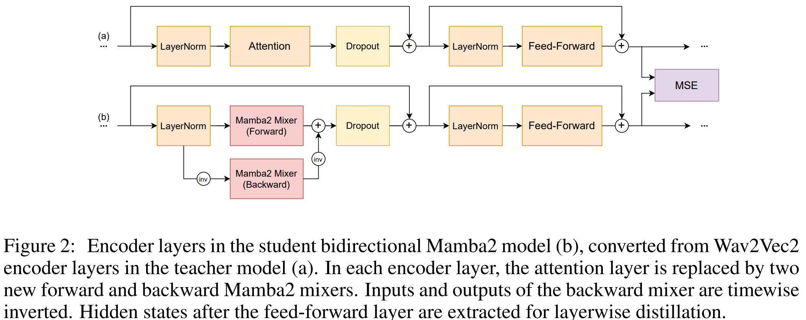

# Usage

This directory contains the code to convert a pretrained HuggingFace Wav2Vec2 model into a bidirectional Mamba2 model as in the figure below, 
by replacing the self-attention layers inside with the BiMamba2Wrapper in `models/mamba_utils.py` when calling 
`substitute_layer(model.wav2vec2.encoder, model.config)` (see `build_asr_model` in `models/build.py`). 
Other pretrained parameters are kept the same.
Then the model can be fine-tuned and distilled using various strategies mentioned in the paper.
The code is partially based on [translation-aided-slu](https://github.com/idiap/translation-aided-slu).

# Replicating Experiments
The ASR (TED-LIUM) and IC (SLURP) datasets can be prepared by following the instructions of the corresponding scripts in `corpora`.
As for SID, please download the dev and test portion, and extract
both of them to the `data/VoxCeleb1/wav` directory altogether. The `wav` directory will then be composed of multiple 
`idXXXXX` subdirectories, each for one speaker.
Experimental results in the paper can be then replicated by the following commands, with arguments filled appropriately.

## Std. Wav2Vec2

### TEDLIUM
`python train.py --model-dir=output/tedlium/direct --data-dir=data/tedlium --mixed_precision bf16 --hparams=asr_use_flash_attn=True,batch_frame_limit=2.5e6,batch_quad_frame_limit=4e11,batch_size=24,data_warmup_steps=10000,loss_normalize_type=sample --accumulation_steps 3 --checkpoint_interval 2000 --project_name tedlium  --max_steps 90000`

### SLURP
`python train.py --model-dir output/slurp/direct --data-dir data/slurp_full --train_meta data/slurp_full/meta.train.syn.txt --vocab-path data/slurp_full/vocab.json --mixed_precision bf16 --hparams=asr_use_flash_attn=True,batch_frame_limit=4e6,batch_quad_frame_limit=6e11,batch_size=72,loss_normalize_type=sample,data_format=nltLa,use_classifier=True,asr_vocab_size=300,ctc_weight=0,warmup_steps=5000 --accumulation_steps 1 --checkpoint_interval 5000 --eval_interval 5000 --use_tf32 --project_name slurp_uptrain  --max_steps 90000`

### VoxCeleb1

We use the metadata from Huggingface. The vocab file is actually not used here so we simply pass the SLURP vocab file.

`python train.py --model-dir output/superb_si/direct --data-dir s3prl/superb--si--data/VoxCeleb1 --vocab-path data/slurp_full/vocab.json --mixed_precision bf16 --hparams=asr_use_flash_attn=True,batch_frame_limit=3e6,batch_quad_frame_limit=4e11,batch_size=24,loss_normalize_type=sample,use_classifier=True,asr_vocab_size=300,ctc_weight=0,warmup_steps=5000,classifier_num_targets=1251 --accumulation_steps 3 --checkpoint_interval 5000 --eval_interval 5000 --use_tf32 --project_name si_uptrain --use_hf_dataset  --max_steps 90000
`

## Target guided

Please fill the BEST_CKPT with the best checkpoint from the Std. Wav2Vec2 training.

### TEDLIUM

``
python train_distill.py --model-dir=output/tedlium/target_guided --data-dir=data/tedlium --mixed_precision bf16 --hparams=asr_use_flash_attn=True,batch_frame_limit=1.9e6,batch_quad_frame_limit=3e11,batch_size=18,data_warmup_steps=10000,asr_use_mamba=True,alpha_layer_distill_loss=15,alpha_logits_distill_loss=1,loss_normalize_type=sample,asr_mamba_residual_inside=False --accumulation_steps 4 --checkpoint_interval 2000 --teacher_path output/tedlium/direct/{BEST_CKPT} --project_name tedlium --max_steps 90000
``

### SLURP
``
python train_distill.py --model-dir=output/slurp/target_guided --data-dir data/slurp_full --train_meta data/slurp_full/meta.train.syn.txt --vocab-path data/slurp_full/vocab.json --mixed_precision bf16 --hparams=asr_use_flash_attn=True,batch_frame_limit=2e6,batch_quad_frame_limit=2e11,batch_size=36,asr_use_mamba=True,alpha_layer_distill_loss=15,alpha_logits_distill_loss=0,loss_normalize_type=sample,data_format=nltLa,use_classifier=True,asr_vocab_size=300,ctc_weight=0,warmup_steps=5000,asr_mamba_residual_inside=False --accumulation_steps 2 --checkpoint_interval 5000 --eval_interval 5000 --use_tf32 --project_name slurp_uptrain --teacher_path output/slurp/direct/{BEST_CKPT} --max_steps 90000
``

###  VoxCeleb1

``
python train_distill.py --model-dir=output/superb_si/target_guided --data-dir s3prl/superb--si--data/VoxCeleb1 --vocab-path data/slurp_full/vocab.json --mixed_precision bf16 --hparams=asr_use_flash_attn=True,batch_frame_limit=2.25e6,batch_quad_frame_limit=3e11,batch_size=18,asr_use_mamba=True,alpha_layer_distill_loss=30,alpha_logits_distill_loss=0,loss_normalize_type=sample,use_classifier=True,asr_vocab_size=300,ctc_weight=0,warmup_steps=5000,classifier_num_targets=1251,asr_mamba_residual_inside=False --accumulation_steps 4 --checkpoint_interval 5000 --eval_interval 5000 --use_tf32 --project_name si_uptrain --use_hf_dataset --teacher_path output/superb_si/direct/{BEST_CKPT} --max_steps 90000
``

## Waypoint guided

### TEDLIUM
``python train_distill.py --model-dir=output/tedlium/waypoint_guided --data-dir=data/tedlium --mixed_precision bf16 --hparams=asr_use_flash_attn=True,batch_frame_limit=1.9e6,batch_quad_frame_limit=3e11,batch_size=18,data_warmup_steps=10000,asr_use_mamba=True,alpha_layer_distill_loss=15,alpha_logits_distill_loss=1,loss_normalize_type=sample,asr_mamba_residual_inside=False --accumulation_steps 4 --checkpoint_interval 2000 --teacher_path output/tedlium/direct/ --use_teacher_snapshots  --project_name tedlium --max_steps 90000
``

### SLURP
``
python train_distill.py --model-dir=output/slurp/waypoint_guided --data-dir data/slurp_full --train_meta data/slurp_full/meta.train.syn.txt --vocab-path data/slurp_full/vocab.json --mixed_precision bf16 --hparams=asr_use_flash_attn=True,batch_frame_limit=2e6,batch_quad_frame_limit=2e11,batch_size=36,asr_use_mamba=True,alpha_layer_distill_loss=15,alpha_logits_distill_loss=0,loss_normalize_type=sample,data_format=nltLa,use_classifier=True,asr_vocab_size=300,ctc_weight=0,warmup_steps=5000,asr_mamba_residual_inside=False --accumulation_steps 2 --checkpoint_interval 5000 --eval_interval 5000 --use_tf32 --project_name slurp_uptrain --teacher_path output/slurp/direct/ --use_teacher_snapshots --max_steps 90000
``

### VoxCeleb1
``
python train_distill.py --model-dir=output/superb_si/waypoint_guided --data-dir s3prl/superb--si--data/VoxCeleb1 --vocab-path data/slurp_full/vocab.json --mixed_precision bf16 --hparams=asr_use_flash_attn=True,batch_frame_limit=2.25e6,batch_quad_frame_limit=3e11,batch_size=18,asr_use_mamba=True,alpha_layer_distill_loss=30,alpha_logits_distill_loss=0,loss_normalize_type=sample,use_classifier=True,asr_vocab_size=300,ctc_weight=0,warmup_steps=5000,classifier_num_targets=1251,asr_mamba_residual_inside=False --accumulation_steps 4 --checkpoint_interval 5000 --eval_interval 5000 --use_tf32 --project_name si_uptrain --use_hf_dataset --teacher_path output/superb_si/direct/ --max_steps 90000 --use_teacher_snapshots
``

## Unguided

Although `asr_mamba_residual_inside` is set to True instead, we found that empirically it will not lead to a worse result in unguided cases.

### TEDLIUM
``
python train.py --model-dir=output/tedlium/unguided --data-dir=data/tedlium --mixed_precision bf16 --hparams=asr_use_flash_attn=True,batch_frame_limit=2.5e6,batch_quad_frame_limit=4e11,batch_size=24,data_warmup_steps=10000,asr_use_mamba=True,loss_normalize_type=sample --accumulation_steps 3 --project_name tedlium --max_steps 90000
``

### SLURP
``
python train.py --model-dir output/slurp/unguided --data-dir data/slurp_full --train_meta data/slurp_full/meta.train.syn.txt --vocab-path data/slurp_full/vocab.json --mixed_precision bf16 --hparams=asr_use_flash_attn=True,batch_frame_limit=5e6,batch_quad_frame_limit=5e10,batch_size=24,loss_normalize_type=sample,data_format=nltLa,use_classifier=True,asr_vocab_size=300,ctc_weight=0,warmup_steps=5000,asr_use_mamba=True --accumulation_steps 3 --checkpoint_interval 5000 --eval_interval 5000 --use_tf32 --project_name slurp_uptrain --max_steps 90000
``

### VoxCeleb1

``
python train.py --model-dir output/superb_si/unguided --data-dir s3prl/superb--si--data/VoxCeleb1 --vocab-path data/slurp_full/vocab.json --mixed_precision bf16 --hparams=asr_use_flash_attn=True,batch_frame_limit=3e6,batch_quad_frame_limit=4e11,batch_size=24,use_classifier=True,asr_vocab_size=300,ctc_weight=0,warmup_steps=5000,classifier_num_targets=1251,asr_use_mamba=True --accumulation_steps 3 --checkpoint_interval 5000 --eval_interval 5000 --use_tf32 --project_name si_uptrain --use_hf_dataset --max_steps 90000
``

## Hybrid

Simply set `alpha_layer_distill_loss=0` and continue training after 40k/30k/50k steps for TEDLIUM/SLURP/VoxCeleb1, respectively.
The script will automatically resume the previous training from the checkpoint in `model-path` with the new argument.

## Evaluation
Run following commands for the evaluation on each of the dataset. The script will automatically load the saved
`hparams.json` under the same directory of CHECKPOINT_PATH for model configuration.

### TEDLIUM
``
python infer.py --model-path output/tedlium/{EXP_NAME}/{CHECKPOINT_PATH} --output-path output/tedlium/test --data-dir=data/tedlium --eval_meta meta.test.txt --hparams asr_use_flash_attn=False
``
### SLURP
``
python infer.py --model-path output/slurp/{EXP_NAME}/{CHECKPOINT_PATH} --output-path output/slurp/test --data-dir=data/slurp_full --eval_meta meta.test.txt --hparams asr_use_flash_attn=False
``

### VoxCeleb1
``
python infer.py --model-path output/superb_si/{EXP_NAME}/{CHECKPOINT_PATH} --output-path output/superb_si/test --data-dir s3prl/superb--si--data/VoxCeleb1 --use_hf_dataset --eval_meta test --hparams asr_use_flash_attn=False --vocab-path data/slurp_full/vocab.json
``